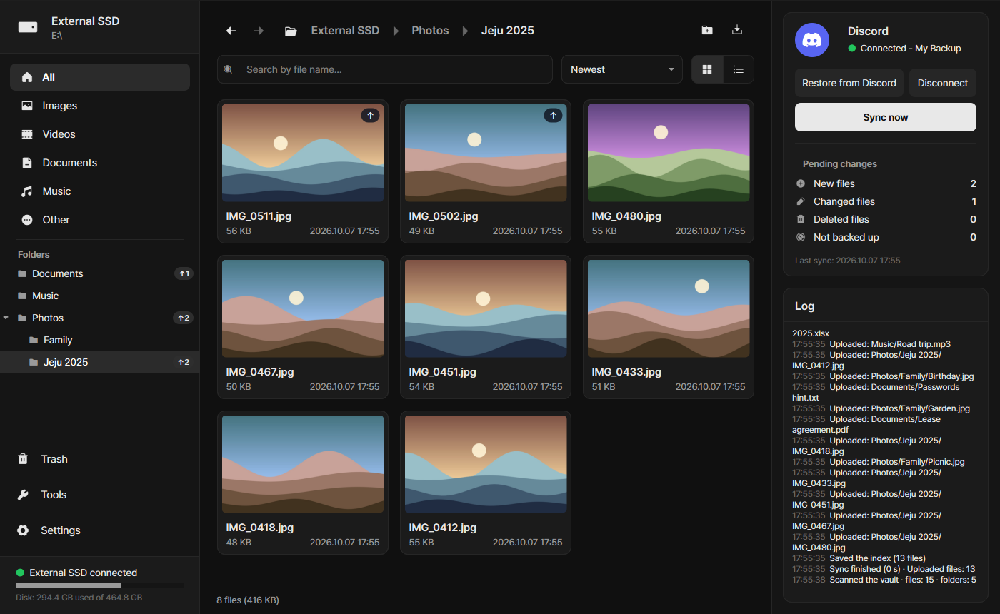
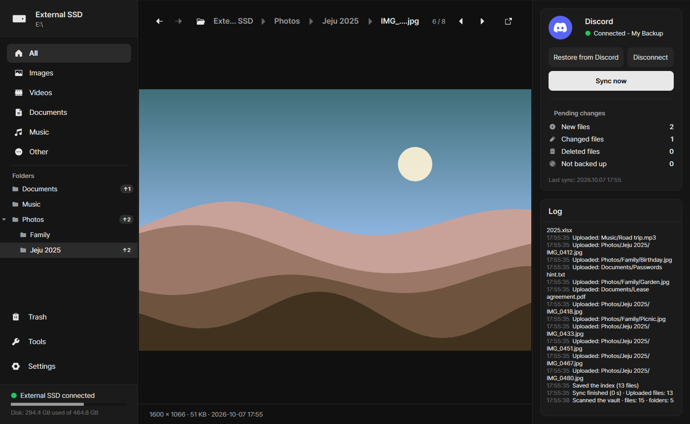
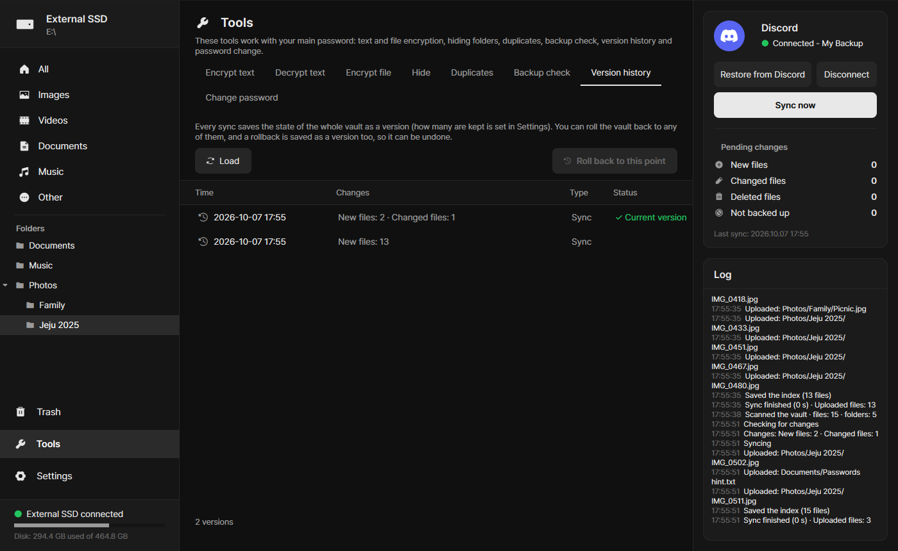
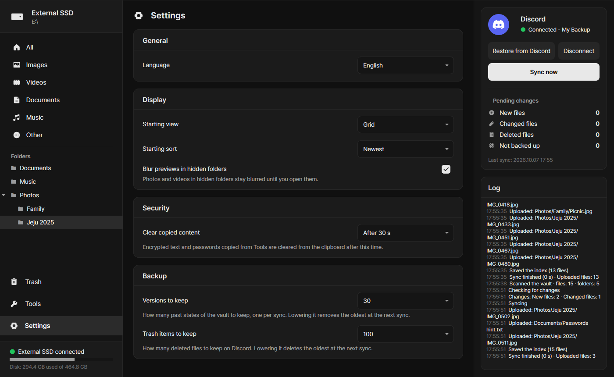

# Secret

[한국어](README.ko.md)

Secret is a portable Windows app for an encrypted USB drive or external disk. It shows the files on the drive in a gallery and, when you press **Sync now**, backs them up to a Discord server you own as end-to-end encrypted messages.

The drive is the original. Discord only ever holds an encrypted copy, and the sync is one-way (drive → Discord). If the drive is lost, you can rebuild every folder and file from Discord with your bot token, server ID and password.



> [!WARNING]
> Discord is not a file storage service. Using a bot to store backups may conflict with Discord's Terms of Service or Developer Policy, and Discord can remove messages, servers or bots at any time. Use Secret at your own risk, keep the drive as your primary copy, and use a private server that only you can see.

## Features

- **Encrypted backup to Discord.** Files are encrypted with AES-256-GCM before upload. Channel names are random (`v-3f9a2c`), and real file names, paths and dates exist only inside an encrypted index.
- **Every file is backed up.** Photos, videos, documents and music get their own menus, and anything else is backed up as "Other". Temporary and lock files are skipped.
- **Restore without the drive.** You only need the bot token, the server ID and your password. Restores can be resumed, and every file is checked against its SHA-256 hash.
- **Version history and trash.** Every sync saves the state of the whole vault as a version, so you can roll back to any of them. Files deleted at sync stay in a trash. How many of each are kept is set in Settings (30 versions and 100 files by default).
- **Backup check.** A quick check confirms every piece is still on Discord with the right size. A full check downloads, decrypts and compares everything in memory.
- **Viewer.** Opens photos (including HEIC), videos, music, PDFs and zip archives (browsed like folders) without extracting them, and edits text files in place.
- **Tools.** Text encryption (`ENC1:` text you can paste into Discord), file encryption up to 200 MB, hiding folders from File Explorer, finding duplicate files, and changing the password.
- **Leaves nothing behind.** Thumbnails and previews stay in memory. Copied passwords are cleared from the clipboard and kept out of Windows clipboard history.
- **Languages:** English, 한국어, 简体中文, 日本語, Русский.

## Screenshots

| Viewer | Version history | Settings |
|---|---|---|
|  |  |  |

The photos in the screenshots are generated samples.

## What Discord can see

Discord, and anyone who can see the server, can see the size of each encrypted message, the number of files, when you synced, and how many top-level and second-level folders you have (one category or channel each). They cannot see file contents, names or paths.

## Getting started

1. Put `Secret.exe` in the root of the drive and run it. The whole drive becomes the vault.
   If you run it from the Windows drive (usually `C:`), only the folder that holds the exe is used.
2. Create a bot in the [Discord Developer Portal](https://discord.com/developers/applications) and invite it to a private server with these permissions:
   View Channels, Manage Channels, Send Messages, Attach Files, Read Message History, Manage Messages, Create Public Threads, Send Messages in Threads, Manage Threads.
3. In Secret, press **Connect**, enter the bot token and server ID, press **Check connection**, and choose a main password.
4. Press **Sync now**, review what will be uploaded and deleted, and start.

**If you forget the main password, nobody can decrypt the backup.** Use a long passphrase.

The bot token, keys and index cache are stored encrypted in the hidden `.secret` folder on the drive.

## How folders map to Discord

| Drive | Discord |
|---|---|
| Top-level folder | Category |
| Second-level folder | Channel |
| Deeper folders | Same channel (the path is kept in the index) |
| Small file | One message |
| Large file | A thread of encrypted pieces (larger pieces on boosted servers) |

## Safety rules

- Files deleted from the drive are removed from Discord only after you confirm them in the sync dialog.
- If any upload fails, nothing is deleted in that run.
- A new index is uploaded before anything is deleted, so an interrupted sync can always be restored and the next sync finishes the job.
- Secret only touches the channels and messages it created. If you write in one of its channels, that channel is left alone.
- The two latest indexes are kept, so a damaged index can fall back to the previous one.

## Building from source

Requires Windows and Python 3.12.

```
build.bat
```

This creates a virtual environment, installs `requirements.txt`, runs the tests and builds `dist\Secret.exe`.

For development:

```
python -m venv .venv
.venv\Scripts\pip install -r requirements.txt
.venv\Scripts\python -m secret.app --root dev_usb
.venv\Scripts\python -m pytest
```

The core (`secret/core`) does not use Qt. Tests run sync, restore and fault injection against an in-memory fake Discord.

## Windows Defender

Executables built with PyInstaller are sometimes flagged by mistake. If that happens, allow `Secret.exe` in Windows Security, or build it yourself from source.

## License

Secret is released under the [GNU General Public License v3.0 or later](LICENSE).
Bundled libraries, fonts and icons are listed in [THIRD_PARTY_NOTICES.md](THIRD_PARTY_NOTICES.md).

Secret is not affiliated with or endorsed by Discord Inc.
